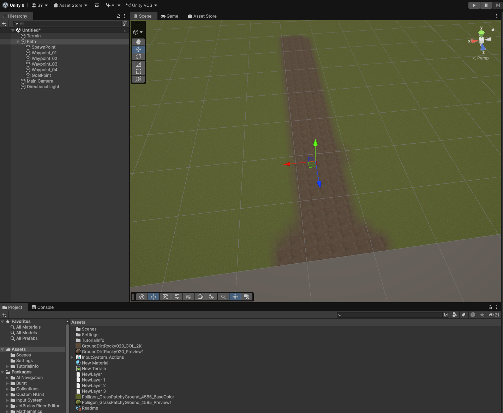

# SlimeDefense Notes

## Note Instructions

Each time a note is added, timestamp it and label it with the relevant phase.
Notes are listed newest first, so add new entries at the top of the Notes
section.

## Notes

### 2026-07-25 05:08 -05:00 | Phase 2

Phase 2 has started. Step-by-step instructions are in `phase2.md`. The two
scripts it needs are committed at `Assets/Scripts/WaypointRoute.cs` and
`Assets/Scripts/Slime.cs`. The remaining work is in the Unity editor: attach
`WaypointRoute` to `Path` and build the `Slime` prefab.

### 2026-07-24 09:36 -05:00 | Phase 1

Terrain has been added to the scene.

### 2026-07-24 09:19 -05:00 | Phase 1

Phase 1 planning has started. The map, grassy terrain, dirt path, and waypoint
setup instructions are documented in `phase1.md`.

### 2026-07-24 08:19 -05:00 | Phase 0

Phase 0 is complete. The Unity 3D project has been generated, Git is initialized, and a Unity-focused `.gitignore` has been added.

### 2026-07-24 08:13 -05:00 | Phase 0

The `SlimeDefense` folder was generated by Unity.

### 2026-07-24 08:13 -05:00 | Phase 0

Keep the project in Git from the beginning with a Unity-focused `.gitignore`.

### 2026-07-24 08:13 -05:00 | Phase 0

Add build support modules as needed:

- WebGL Build Support
- Android Build Support
- iOS Build Support, later if Apple/mobile builds become a goal

### 2026-07-24 08:13 -05:00 | Phase 0

Use the current **Unity LTS** editor version through Unity Hub.

### 2026-07-24 08:13 -05:00 | Phase 0

The recommended starting movement system is **waypoints** rather than NavMesh. This keeps the first playable version simple while still allowing a fully 3D presentation.

### 2026-07-24 08:13 -05:00 | Phase 0

This project is being built as a **3D Unity project** so towers, enemies, projectiles, terrain, and props can use 3D models.
