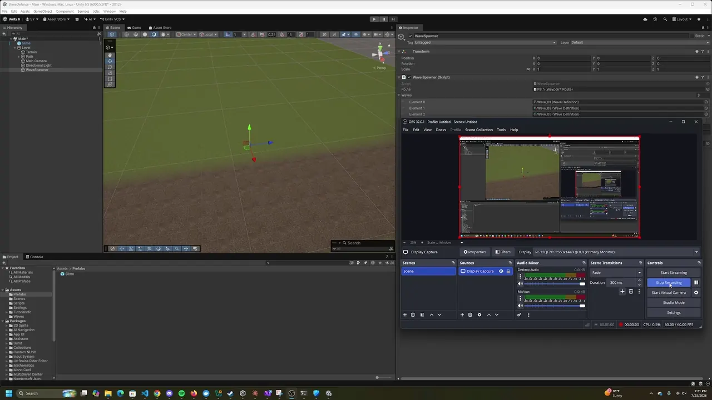
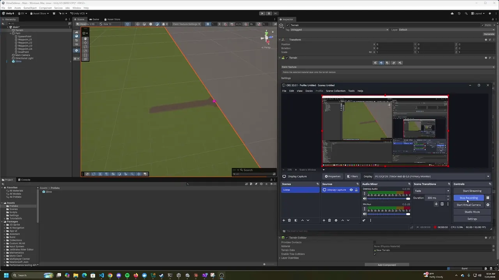
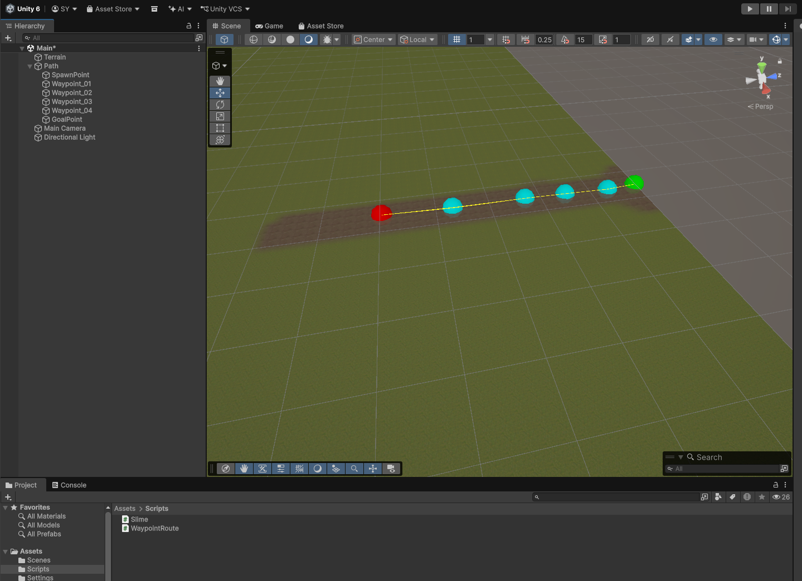
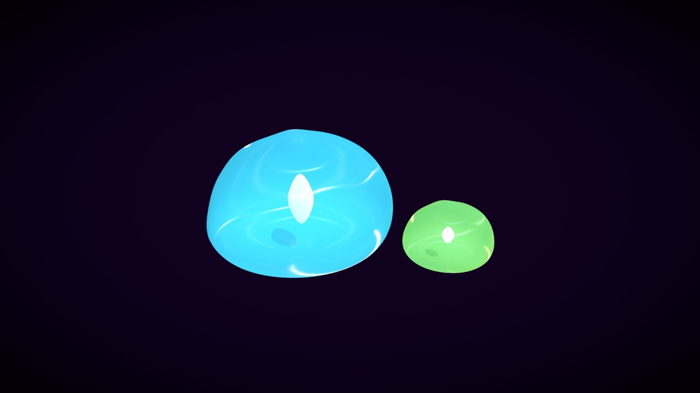
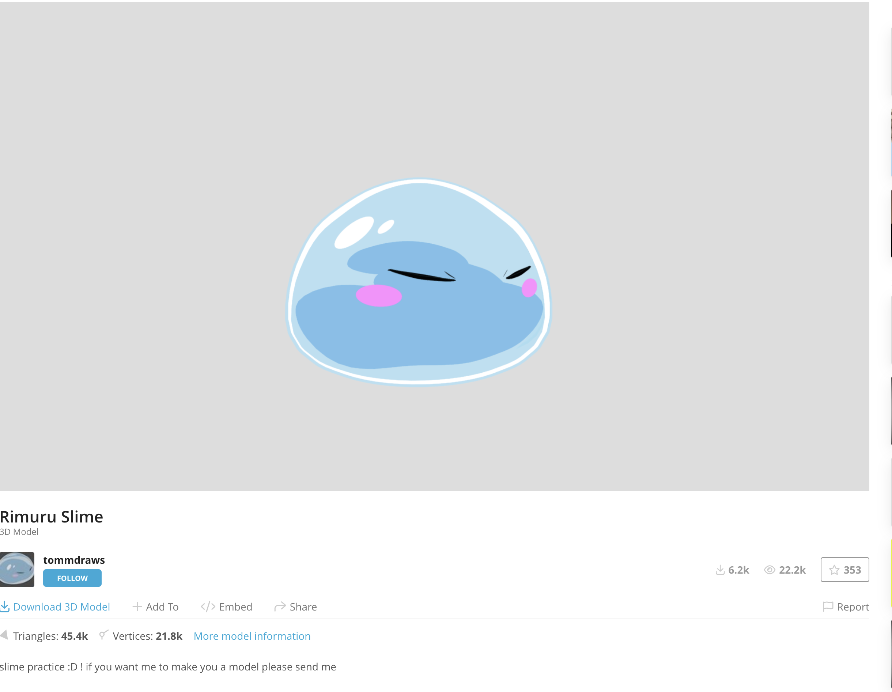

# SlimeDefense Notes

## Note Instructions

Each time a note is added, timestamp it and label it with the relevant phase.
Notes are listed newest first, so add new entries at the top of the Notes
section.

## Notes

### 2026-07-25 19:23 -05:00 | Phase 3

Phase 3 has started. `WaveSpawner` is attached to the scene with its `Route`
pointing at `Path` and three `Wave Definition` elements assigned.

### 2026-07-25 06:58 -05:00 | Phase 2

Phase 2 is complete. One slime walks the full route from `SpawnPoint` to
`GoalPoint` and despawns on arrival, with `Speed`, `Health`, and
`Arrive Distance` editable on the prefab at `Assets/Prefabs/Slime.prefab`.

Every item on the Phase 2 completion checklist in `phase2.md` is satisfied. No
spawner, tower, or damage code exists yet — those are Phases 3 through 5.

### 2026-07-25 06:29 -05:00 | Phase 2

`WaypointRoute` is attached to `Path` and the route gizmos are visible along the
path. Spawn is green, the goal is red, the points between are cyan, and yellow
lines connect them in order.

### 2026-07-25 05:15 -05:00 | Phase 2

Alternate slime model under consideration. This one has no face to remove, and
it contains two slimes at different sizes, which could cover two enemy types in
Phase 8.

Source: [Slimes by MartinDL](https://sketchfab.com/3d-models/slimes-61de4624789d468b864d826ec02b636c)
(63.5k triangles, 31.8k vertices, published 2022-11-16)

License: CC Attribution (CC BY), the same terms as the other candidate.

### 2026-07-25 05:12 -05:00 | Phase 2

This model will be used for the slime enemy, modified to remove the face.

Source: [Rimuru Slime by tommdraws](https://sketchfab.com/3d-models/rimuru-slime-612ff2c805114744b66d3c29c7942371)
(45.4k triangles, 21.8k vertices)

License: CC Attribution (CC BY). Modification is allowed, so removing the face
is fine. Credit is required, and the modification has to be disclosed. The
attribution text is in `CREDITS.md` and needs to reach an in-game credits screen
in Phase 7.

### 2026-07-25 05:08 -05:00 | Phase 2

Phase 2 has started. Step-by-step instructions are in `phase2.md`. The two
scripts it needs are committed at `Assets/Scripts/WaypointRoute.cs` and
`Assets/Scripts/Slime.cs`. The remaining work is in the Unity editor: attach
`WaypointRoute` to `Path` and build the `Slime` prefab.

### 2026-07-24 09:36 -05:00 | Phase 1

Terrain has been added to the scene.

### 2026-07-24 09:19 -05:00 | Phase 1

Phase 1 planning has started. The map, grassy terrain, dirt path, and waypoint
setup instructions are documented in `phase1.md`.

### 2026-07-24 08:19 -05:00 | Phase 0

Phase 0 is complete. The Unity 3D project has been generated, Git is initialized, and a Unity-focused `.gitignore` has been added.

### 2026-07-24 08:13 -05:00 | Phase 0

The `SlimeDefense` folder was generated by Unity.

### 2026-07-24 08:13 -05:00 | Phase 0

Keep the project in Git from the beginning with a Unity-focused `.gitignore`.

### 2026-07-24 08:13 -05:00 | Phase 0

Add build support modules as needed:

- WebGL Build Support
- Android Build Support
- iOS Build Support, later if Apple/mobile builds become a goal

### 2026-07-24 08:13 -05:00 | Phase 0

Use the current **Unity LTS** editor version through Unity Hub.

### 2026-07-24 08:13 -05:00 | Phase 0

The recommended starting movement system is **waypoints** rather than NavMesh. This keeps the first playable version simple while still allowing a fully 3D presentation.

### 2026-07-24 08:13 -05:00 | Phase 0

This project is being built as a **3D Unity project** so towers, enemies, projectiles, terrain, and props can use 3D models.
