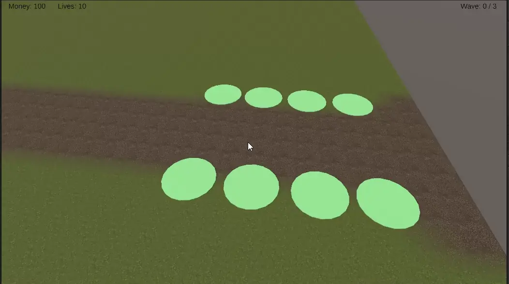
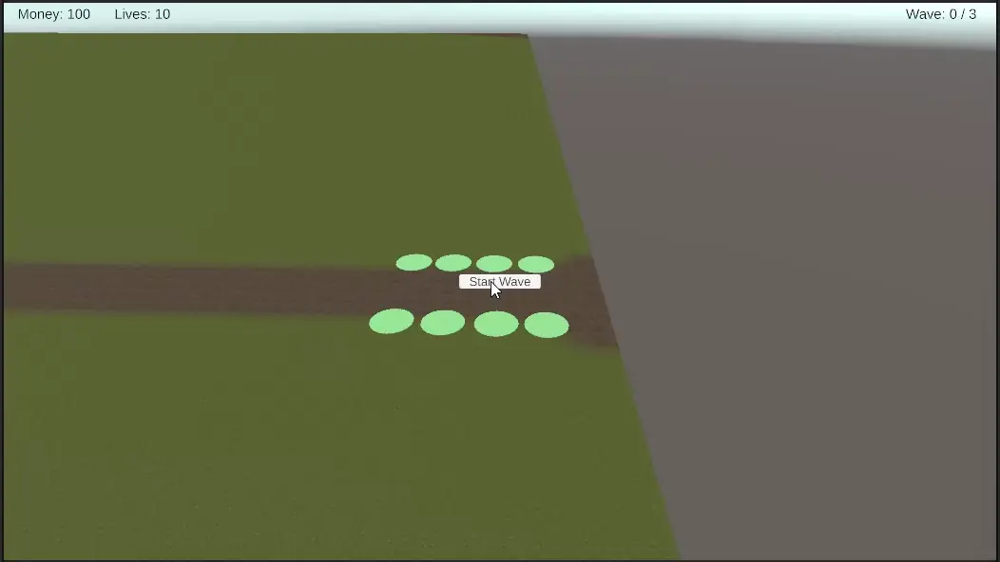

# SlimeDefense Notes

## Note Instructions

Each time a note is added, timestamp it and label it with the relevant phase.
Notes are listed newest first, so add new entries at the top of the Notes
section.

## Notes

### 2026-07-28 17:55 -05:00 | Phase 9

Every prefab now carries its new model. The art swap that started this morning
is finished across the board rather than on the one or two things the last clip
happened to show.

Worth saying once, because it is the payoff for a rule the project has followed
since Phase 1: none of this needed gameplay code. A model is a prefab's business,
levels carry their own models as data, and the placement, targeting, and damage
systems never learn what any of it looks like. The one thing that did have to be
taught about models was the upgrade swap, and that was two bugs about where a
prefab's stored coordinates come from, not about the models themselves.

### 2026-07-28 12:55 -05:00 | Phase 9

Phase 9 has started, and the polish is going in art first: brand new Meshy
models are replacing what the earlier phases were built on. Every phase up to
now kept the game playable on placeholders, which is what made swapping them a
change of assets rather than a change of code.

The rest of what this phase covers is in the roadmap — audio, hit flashes and
death effects, floating damage and money numbers — and none of it is in yet.

### 2026-07-28 08:35 -05:00 | Phase 8D

Object pooling is in, which was the last untouched part of Phase 8. Slimes and
projectiles are now reused rather than created and destroyed —
`Assets/Scripts/ObjectPool.cs` hands out copies keyed by prefab, and
`PooledInstance.cs` is the receipt stamped on each copy saying where it came
from. Towers deliberately stay on Instantiate and Destroy: a handful exist, they
are built and sold by hand, and pooling them would buy nothing while adding a
reset path to get wrong.

No editor work this time. The pool creates itself on first use, because one that
had to be dragged into the scene is one that goes missing and silently turns
every spawn back into an Instantiate.

The rule the part turns on: **a pooled object is deactivated, not destroyed**,
so `Awake` and `Start` run once in the object's entire lifetime while `OnEnable`
and `OnDisable` run once per life. Everything that has to be true at the start of
a life belongs in `OnEnable`. Two files were already written to that rule and
needed nothing — `HealthBar` had been on `OnEnable`/`OnDisable` since Part C
precisely for this, and `Slime`'s slow was a multiplier applied at movement time
rather than a written-over `speed`, so there was no original value to restore.

Three things did need moving, and each one is a trap that would have looked like
a different bug:

- **Registration.** `Slime` counted itself onto the board in `Start`, which a
  reused slime never gets. It now registers in `SetRoute`, which is the honest
  moment anyway: before it has a route it has nowhere to walk. Left in `Start`,
  every slime after the first would have been invisible to the victory check.
- **A projectile's lifetime.** It was a `Destroy(gameObject, lifetime)` scheduled
  in `Start`. On a pooled shot that fires once and then hundreds of times, the
  single scheduled destroy lands three seconds into the *first* flight — most
  likely while the object is airborne on its fifth. It is now a deadline set in
  `OnEnable`.
- **`target == null` no longer means the target is gone.** This is the one worth
  remembering. A pooled slime that dies is parked, not destroyed, so the
  reference stays perfectly valid — and once the pool hands that body out again,
  a shot still in the air would home in on a completely different slime and
  damage it. Projectiles now ask `Slime.IsInPlay`. Every future system that holds
  a slime across frames has to ask the same thing.

Prewarming is in too, because an empty pool costs exactly what no pool costs for
the first slime of each type, and a wave's worth of first slimes all arrive
within a second of each other. `WaveSpawner` warms each slime type with the
largest single group of it in the whole wave list, before the first wave.

Phase 8 is complete.

The live demo is playable in the browser here:
<https://play.unity.com/en/games/71a052ff-c9ab-407e-a74e-bf77544a5248/slime-defense-test>

### 2026-07-28 04:57 -05:00 | Phase 8

Phase 8 is almost complete. Three tower types with upgrade ladders and selling,
three slime types, waves built from groups, and towers that change model as they
level. Object pooling — Part D — is the only part still untouched.

Some bugs remain around tower upgrades, and they are worth writing down rather
than rediscovering:

- The upgrade models for frost and splash were landing about a thousand units
  from their towers. Not the swap failing — the swap working on a prefab whose
  stored position was the scene coordinate it happened to be dragged from.
  `RefreshModel` instantiates with `worldPositionStays: false` to preserve each
  mesh's base height, and that faithfully preserved the horizontal offset too.
  It now keeps the local Y and zeroes X and Z, because only the height was ever
  meaningful. Four model prefabs still hold scene coordinates in their files;
  they are simply no longer consulted.
- Towers built through `BuildNode.Place` never had this problem, because that
  uses the explicit-world-position overload, which discards the prefab transform
  outright. Same numbers in the file, opposite consequences, purely from which
  overload each path uses — worth remembering before writing a third one.
- A baked-in model still sits on each tower prefab as a sibling of `ModelRoot`
  rather than inside it, so `RefreshModel`'s hide pass never reaches it. Level 0
  therefore keeps whatever the prefab ships with, which is currently the wanted
  behaviour, but the two systems only agree by accident.
- The frost tower cannot deepen its slow as it levels. `slowFactor` and
  `slowDuration` live on the `FrostTower` component rather than in the level
  rows, so upgrading widens its reach and quickens its fire and nothing else.

Everything in this phase that went wrong went wrong the same way: a prefab made
by dragging an object out of a scene keeps that scene's coordinates, and
something later applies them as if they were an offset. It cost a misplaced
tower, a buried tower, an arrow eleven units from its own projectile, and four
upgrade models a kilometre off the map.

### 2026-07-27 21:18 -05:00 | Phase 8C

Multiple mobs have been added. There are three slime types now — the baseline, a
fast fragile runner, and a slow armoured one worth killing — and a wave is a list
of groups rather than one prefab on a timer.

`Slime.cs` gained a damage multiplier, a flying flag, and a flight height.
`WaveDefinition.cs` became a list of `WaveGroup`s, each with its own prefab,
count, spacing, and lead-in delay, and `WaveSpawner.RunWave` gained an outer loop
over them. Phase 3 predicted that change and said the inner per-slime loop would
survive it largely intact; it did, untouched below the group check. That is what
the wave data having been a ScriptableObject from the start bought.

The rule the part turns on, and it is answered differently in each direction:
**enemies vary by value, so they are three prefabs of one class; towers vary by
behaviour, so they are subclasses.** A runner that is only different numbers does
not need a `SlimeRunner` class, and a class whose entire content is different
numbers cannot be tuned without recompiling.

Armour is one line — `health -= amount * damageMultiplier` — and Phase 5 predicted
it exactly when it argued that damage was the slime's business to interpret.
`Projectile`, `Tower`, `SplashTower`, and `FrostTower` all needed no change
whatsoever to support an armoured enemy.

Flying is data on both sides: a flag on the slime, a `Can Hit Flying` flag on the
tower definition, and a skip during target selection rather than at fire time, so
a ground-only tower keeps shooting whatever else is in range instead of standing
idle under a flyer. Height is applied once when the route is assigned — movement
copies the slime's own y onto its target every frame, so a slime that starts above
the path stays there and no movement code knows flying exists.

Making the variants turned up four failures, three of them silent:

- The duplicated prefabs' sprite children came back on the Default layer. The
  enabled collider lives on that child, the towers' detection mask is the Slime
  layer only, so the new mobs were not ignored by the towers — they were invisible
  to them.
- The sprite animation binds to `m_Sprite` with an empty path, meaning the
  renderer on the Animator's *own* object. A variant with the Animator on its root
  animates nothing, because the root has no renderer.
- All three sheets are sliced identically at 73 frames, so the fix is one clip per
  colour behind a shared state machine — an Animator Override Controller each,
  rather than three copies of the controller. Assigning one of those overrides to
  the root Animator instead of the sprite child gives an animated slime in the
  wrong colour, which is what happened to the green one.
- Every slime still carries a second Animator on its root that cannot drive
  anything. It is what made the mix-up above possible: two slots, one of which
  does nothing.

Still open: the armoured slime's damage multiplier is at 1, so its armour is not
doing anything yet, and the slime colliders are still non-triggers at roughly four
world units against a tower range of six. Part D — object pooling — is what
remains of Phase 8.

### 2026-07-27 19:09 -05:00 | Phase 8B

Basic tower upgrades are implemented. A placed tower can be selected, upgraded
through a ladder of levels, and sold back for part of what it cost.

`TowerLevel` is a row of stats — cost, range, damage, fire rate — and a
`TowerDefinition` now holds an array of them. Level 0 *is* the tower as built, so
the array is the whole stat block and there is no separate base to keep in step
with the upgrades. Explicit rows rather than a multiplier per level: compounding
makes level five an accident instead of a decision, and there is no way to write
a rung that trades range for fire rate.

`TowerInspectorPanel.cs` is new and shows the selected tower's name, level, and
stats with buttons to upgrade or sell. It owns no rules. Every transaction goes
through `TowerPlacer`, which already checked affordability and spent money when
building — one place that touches the balance is far easier to keep correct than
three that each nearly do. `BuildNode` gained `Clear`, collecting on the `Tower`
reference it has held since Phase 4 for exactly this.

Selling returns 70% of everything spent, build plus upgrades. At 100% selling is
free undo and the best play is rebuilding the board every wave; below about 50%
nobody sells and the feature is decoration.

Towers can also change model as they level. `TowerLevel` carries an optional
model, `Tower` mounts it under a `ModelRoot` child, and a level that leaves it
empty keeps whatever is already showing — so only the rungs that actually change
appearance need one. A model baked into the tower prefab is hidden the first time
a level supplies its own, which is what stops an upgrade leaving two towers
standing inside each other.

The recurring fault this part is the same one Part A had: a model dragged into a
prefab keeps whatever local offset it happened to land on, and the tower roots
are scaled ×4, so a nudge of 1.77 becomes seven world units and the tower renders
a node away from the one it is standing on. A prefab made by dragging an object
out of a scene also keeps its scene coordinates as its local position, which puts
a swapped model a thousand units away rather than slightly off.

Upgrade ladders exist for all three towers. Per-level models are only set on the
pebble tower; the splash and frost towers keep one model at every level. Frost
upgrades widen its reach and quicken its fire but cannot deepen the slow itself,
because `slowFactor` and `slowDuration` live on the `FrostTower` component rather
than in the level rows — deliberate, since a shared level row carrying every
type's parameters is mostly meaningless fields.

Parts C and D — enemy variety with wave groups, and object pooling — are still
ahead.

### 2026-07-27 15:15 -05:00 | Phase 8A

Phase 8 Part A is complete. There are three tower types now, a panel to pick
between them, and money finally buys different things rather than more of the
same thing.

`TowerDefinition.cs` is new and holds one type's stats as an asset, the same way
`WaveDefinition` holds a wave. `Tower.cs` reads its numbers from one of those
instead of carrying its own, and `SplashTower.cs` and `FrostTower.cs` override
what happens when a shot lands. `TowerPicker.cs` drives the panel and is the
first thing besides a label to subscribe to `MoneyChanged` — buttons grey out
when you cannot afford them.

The split the phase turns on: **towers vary by behaviour, so they are subclasses;
their numbers vary by value, so those are assets.** A splash tower is not a
pebble tower with a splash radius of zero.

`Projectile.cs` now remembers the *tower* that fired it and hands the arrival
back to it, rather than carrying a damage number. That keeps one projectile class
that knows how to travel and nothing else, and every effect in the tower type it
belongs to. It also means a tower sold mid-flight in Part B leaves a shot holding
a destroyed reference, which is guarded the same way the dead target is.

Four things broke, and every one of them was silent:

- The picker's three "buttons" were 3D `TextMeshPro` objects — no `Button`, no
  `Image`, and not even a `Graphic` to raycast against. They were never going to
  receive a click. **GameObject > 3D Object > Text** and **GameObject > UI >
  Button** are one menu apart.
- Replacing `TowerPlacer`'s `Tower Prefab` field with `Default Definition` left
  the slot empty, and the placer disables itself when it has nothing to build. It
  looked like every one of the 200 build nodes had stopped working.
- All three tower models sat at a lateral offset inside their prefabs, so a
  placed tower stood beside its node rather than on it — worst on the frost
  tower, whose ×8 root scale multiplied a small offset into 3.5 world units. The
  logic was always on the node; only the mesh was elsewhere.
- The splash tower was 4.09 units underground. Its mesh bounds came out of the
  binary FBX directly: all three models are Z-up with the pivot at their centre,
  so the base sits at zero when the model's local Y is the negative of its lowest
  vertex. The ruined keep and the mage spire are still planted 1.11 and 0.63
  units into the ground, which currently looks deliberate.

Alongside this, `OrbitCamera.cs` gives the player a camera at last — right-drag
orbits, middle-drag pans, the wheel zooms, and two fingers pan, pinch, and twist.
Left-click stays purely placement, because `TowerPlacer` acts the instant the
button goes down and could never tell a drag from a click. It rebuilds the
transform from a pivot, a yaw, a pitch, and a distance every frame, which also
zeroed the 9.4 degrees of camera roll that `SpriteBillboard` had been copying
onto every slime sprite.

Parts B, C, and D — upgrades and selling, enemy variety, and object pooling — are
still ahead.

### 2026-07-27 11:35 -05:00 | Phase 7

Custom sprites are enabled. The slime is now a billboarded animated sprite rather
than the imported 3D mesh, with a jump cycle playing as it walks the route.

New assets: `Assets/Sprites/slimesprite-transparent.png`, the `slimejump` clip and
its controller under `Assets/Animation`, and `Scripts/SpriteBillboard.cs`, which
copies the camera's rotation in `LateUpdate`. Running in `LateUpdate` is what
keeps it compatible with the Phase 2 facing fix: `Slime.Update` still aims the
root down the path, and the billboard turns only the sprite child afterwards, so
the path decides where the slime is going and the camera decides which way the
picture faces.

Projectiles now home on `Slime.AimPosition` instead of `transform.position`.
The root stays on the ground along the path while the sprite stretches and leaves
it during the jump, so aiming at the root meant shots arriving underneath an
airborne slime. `AimPosition` returns the sprite renderer's bounds center, which
follows whatever frame is currently displayed.

The Meshy Blue Pebble mesh is no longer referenced by the prefab. `CREDITS.md`
still lists it and the Sketchfab candidates, and needs revisiting to say what is
actually in the game.

Two things this changed by accident, both worth handling before Phase 8
duplicates the prefab into enemy variants:

- The oversized detection sphere left over from Phase 5 went away with the mesh
  child it was attached to. The live collider is now `1.435` on `SpriteVisual`,
  which the root's scale of `3` makes about `4.3` units in world space — sane
  compared to the old one, still large next to a tower `Range` of `6`.
- That collider is **not** a trigger. Phase 5 required one so slimes could be
  found by queries without taking part in collision resolution.

### 2026-07-27 10:35 -05:00 | Phase 7

Phase 7 is complete. Money, lives, and the wave counter are on screen, the run
starts from a button instead of on its own, and it ends with a panel that says
which way it went and offers to play again.

`Hud.cs` and `EndOfRunPanel.cs` are new. `GameManager.cs` gained a live slime
count, a victory condition, and `Restart`; `WaveSpawner.cs` announces wave
progress and tells the manager when its list is exhausted; `Slime.cs` registers
and unregisters itself; `TowerPlacer.cs` ignores presses that landed on the HUD,
which is the guard Phase 4 said belonged here.

Nothing polls. Every label is written when the value behind it changes, which is
what the Phase 6 events were built for a phase early.

Three bugs, and all three were silent — nothing logged, nothing threw:

- The Canvas was created while `Level` was selected, so it became a child of a
  world object a thousand units from the origin and serialized with a scale of
  zero. Every label was present, enabled, and white, and none of them rendered.
  A `Screen Space - Overlay` canvas has to be a root object.
- The Start Wave button's `On Click ()` had `WaveSpawner.cs` — the *script asset*
  from the Project window — in its object slot rather than the `WaveSpawner`
  object from the Hierarchy. Unity accepted it, the function dropdown had no
  component methods to offer, and the saved method name was empty. The button
  highlighted and animated and called nothing. It is wired in code now, through a
  typed `Button` field that cannot be given the wrong thing.
- Both new listeners subscribed in `OnEnable` and guarded `GameManager.Instance`
  for null. When `OnEnable` ran before the manager's `Awake`, that guard skipped
  the subscription for the whole run, and the money label sat on its editor text
  — which read `Money: 100` and matched the starting money, so it looked correct
  and never moved. Both now subscribe from `OnEnable` and `Start`, with a flag
  making whichever arrives first the only one that acts.

Still to do before this is shippable: `Main.unity` is not in Build Settings — the
list still holds only the deleted `SampleScene` — so `Restart` has nothing to
load outside the editor, and a build would ship no scenes.

No tower selection panel. There is one tower type, so it would be a panel with
one button; Phase 8 adds the types and the panel together.

### 2026-07-27 09:37 -05:00 | Phase 6

Phase 6 is complete. Killing a slime pays, building a tower spends, and a slime
reaching the goal costs a life. At zero lives the run ends: spawning stops and
placement stops.

`GameManager.cs` is new and owns all of it — money, lives, and whether the run is
over — with `MoneyChanged`, `LivesChanged`, and `GameOver` events for Phase 7's
HUD to subscribe to. `Slime.cs` gained `Reward` and `Life Cost`, and the `Die`
and `ReachGoal` pair that Phase 5 deliberately kept separate finally diverged.
`TowerPlacer.cs` checks affordability, builds, and only then charges, so a
refused placement never takes the player's money. `WaveSpawner.cs` calls its own
`StopWaves` on game over. `Tower.cs` needed no changes at all — it already
carried its own price.

The numbers are tuned against this level rather than picked: 8 build nodes, 25
slimes across the three waves, 10 per kill and 50 per tower, so a perfect run
affords 7 towers and the map can never be filled. That is the answer to Phase 5
ending with towers that were free and unlimited.

Play testing turned up a prefab bug rather than a code one: `Slime.prefab` had
two `Slime` components, one on the root and one added to the Meshy model child.
Since the root's collider was disabled, towers targeted the child, and killing it
destroyed only the model — leaving an invisible slime that walked on and cost a
life. The duplicate has been removed. The child's collider is still the enabled
one at radius `6.89` on an object scaled `200`, which is worth checking against
what `Range` is supposed to mean.

Money and lives are still only visible in the Console via `Log Changes`. There is
no HUD, no victory condition, and no restart — that is Phase 7, and the events
above are what it will hang off.

### 2026-07-27 06:10 -05:00 | Phase 5

Phase 5 is complete. Towers detect slimes inside their `Range`, fire projectiles
at the one furthest along the route, and slimes die at zero health. Where the
tower goes now decides which slimes get through.

Every item on the Phase 5 completion checklist in `phase5.md` is satisfied.
`Projectile.cs` is new; `Tower.cs` gained detection, targeting, and firing;
`Slime.cs` gained `RouteProgress`, `TakeDamage`, and a `Die` separate from
`ReachGoal`. Slimes sit on the `Slime` layer with a trigger collider, and the
tower's `Slime Mask` matches it, so detection never considers terrain, nodes, or
other towers.

Targeting is first-in-line rather than nearest, because the slime closest to the
goal is the most urgent threat. Projectiles home on their target and null-check
it every frame, so a slime dying mid-flight is a shot that gives up rather than a
`MissingReferenceException`.

Killing a slime still pays nothing and letting one through still costs nothing.
`Die` and `ReachGoal` are the two hooks waiting for Phase 6 to wire money and
lives into.

### 2026-07-26 10:09 -05:00 | Phase 4

Phase 4 is complete. Clicking a build node beside the path places a tower on it,
the node highlights on hover and locks once occupied, and waves keep running
underneath the whole time.

Every item on the Phase 4 completion checklist in `phase4.md` is satisfied. The
placement ray filters on the `BuildNode` layer, so there is no rule forbidding
towers on the path — there is simply no node there to hit.

The tower is a Meshy AI generated model imported as `.fbx`, with its textures
extracted from the FBX's embedded data into `Assets/TowerTextures`. Its license
terms still need to be confirmed and recorded in `CREDITS.md`.

No targeting, shooting, damage, or currency code exists yet — those are Phases 5
and 6.

### 2026-07-25 19:23 -05:00 | Phase 3

Phase 3 has started. `WaveSpawner` is attached to the scene with its `Route`
pointing at `Path` and three `Wave Definition` elements assigned.

### 2026-07-25 06:58 -05:00 | Phase 2

Phase 2 is complete. One slime walks the full route from `SpawnPoint` to
`GoalPoint` and despawns on arrival, with `Speed`, `Health`, and
`Arrive Distance` editable on the prefab at `Assets/Prefabs/Slime.prefab`.

Every item on the Phase 2 completion checklist in `phase2.md` is satisfied. No
spawner, tower, or damage code exists yet — those are Phases 3 through 5.

### 2026-07-25 06:29 -05:00 | Phase 2

`WaypointRoute` is attached to `Path` and the route gizmos are visible along the
path. Spawn is green, the goal is red, the points between are cyan, and yellow
lines connect them in order.

### 2026-07-25 05:15 -05:00 | Phase 2

Alternate slime model under consideration. This one has no face to remove, and
it contains two slimes at different sizes, which could cover two enemy types in
Phase 8.

Source: [Slimes by MartinDL](https://sketchfab.com/3d-models/slimes-61de4624789d468b864d826ec02b636c)
(63.5k triangles, 31.8k vertices, published 2022-11-16)

License: CC Attribution (CC BY), the same terms as the other candidate.

### 2026-07-25 05:12 -05:00 | Phase 2

This model will be used for the slime enemy, modified to remove the face.

Source: [Rimuru Slime by tommdraws](https://sketchfab.com/3d-models/rimuru-slime-612ff2c805114744b66d3c29c7942371)
(45.4k triangles, 21.8k vertices)

License: CC Attribution (CC BY). Modification is allowed, so removing the face
is fine. Credit is required, and the modification has to be disclosed. The
attribution text is in `CREDITS.md` and needs to reach an in-game credits screen
in Phase 7.

### 2026-07-25 05:08 -05:00 | Phase 2

Phase 2 has started. Step-by-step instructions are in `phase2.md`. The two
scripts it needs are committed at `Assets/Scripts/WaypointRoute.cs` and
`Assets/Scripts/Slime.cs`. The remaining work is in the Unity editor: attach
`WaypointRoute` to `Path` and build the `Slime` prefab.

### 2026-07-24 09:36 -05:00 | Phase 1

Terrain has been added to the scene.

### 2026-07-24 09:19 -05:00 | Phase 1

Phase 1 planning has started. The map, grassy terrain, dirt path, and waypoint
setup instructions are documented in `phase1.md`.

### 2026-07-24 08:19 -05:00 | Phase 0

Phase 0 is complete. The Unity 3D project has been generated, Git is initialized, and a Unity-focused `.gitignore` has been added.

### 2026-07-24 08:13 -05:00 | Phase 0

The `SlimeDefense` folder was generated by Unity.

### 2026-07-24 08:13 -05:00 | Phase 0

Keep the project in Git from the beginning with a Unity-focused `.gitignore`.

### 2026-07-24 08:13 -05:00 | Phase 0

Add build support modules as needed:

- WebGL Build Support
- Android Build Support
- iOS Build Support, later if Apple/mobile builds become a goal

### 2026-07-24 08:13 -05:00 | Phase 0

Use the current **Unity LTS** editor version through Unity Hub.

### 2026-07-24 08:13 -05:00 | Phase 0

The recommended starting movement system is **waypoints** rather than NavMesh. This keeps the first playable version simple while still allowing a fully 3D presentation.

### 2026-07-24 08:13 -05:00 | Phase 0

This project is being built as a **3D Unity project** so towers, enemies, projectiles, terrain, and props can use 3D models.
